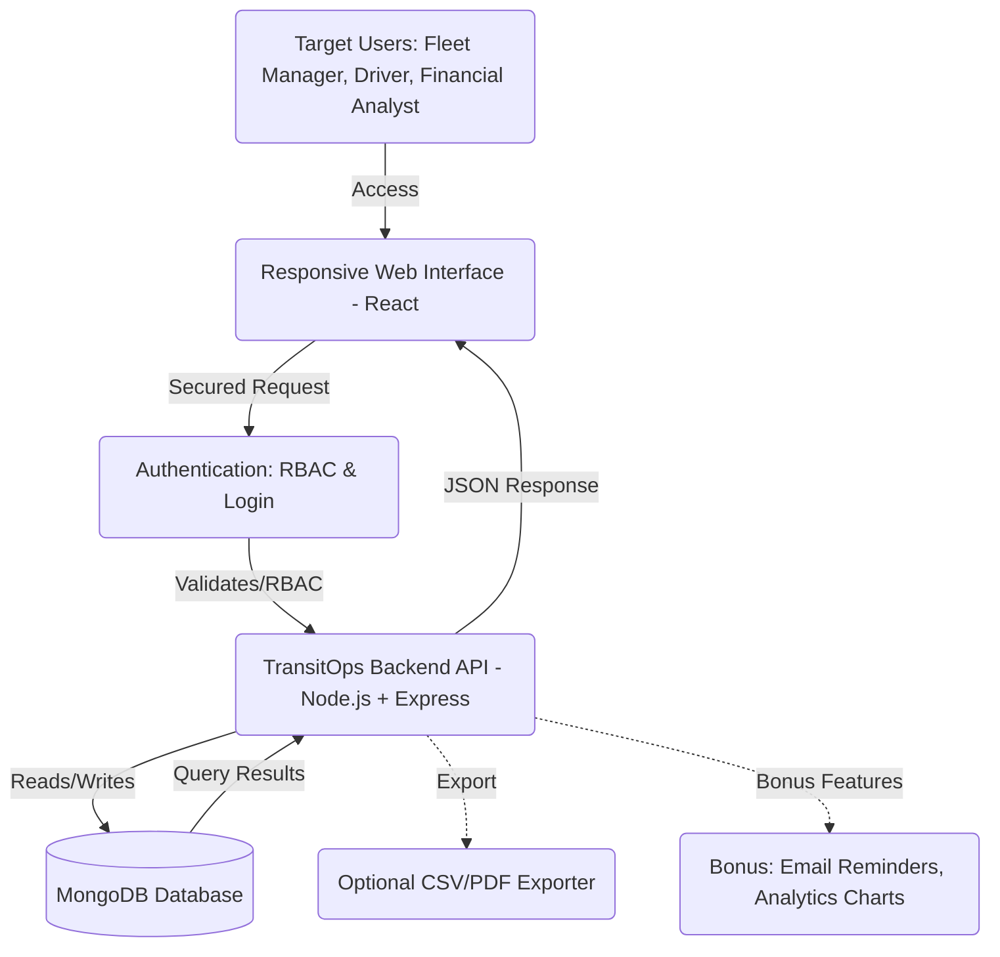
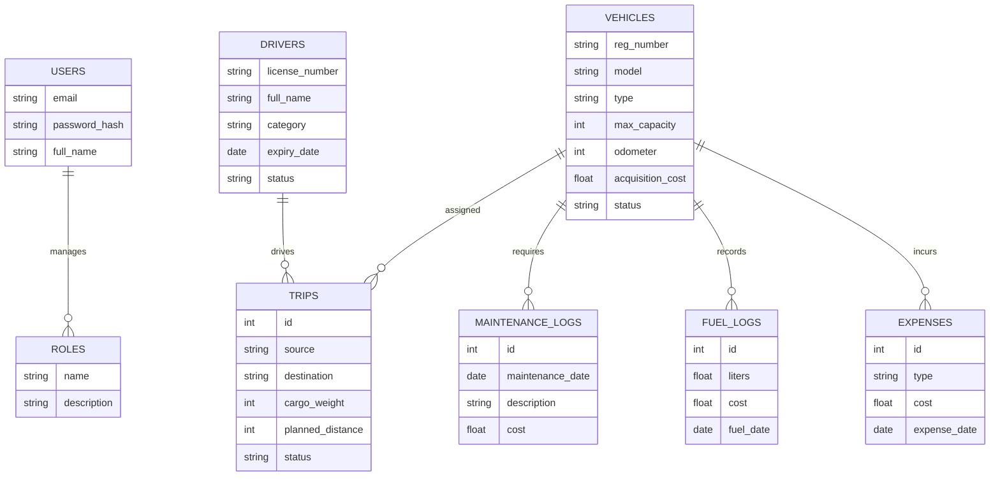
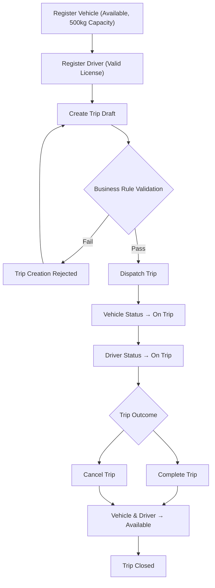

# TransitOps — Smart Transport Operations Platform

TransitOps is a centralized, real-time transport operations platform designed to digitize fleet management, driver registries, dispatching, maintenance scheduling, and expense logs. It replaces manual logs and spreadsheets with a single, transactional, MERN-stack monolith that enforces strict business rules, handles concurrent operations safely, and provides analytical insights.

---

## 🗺️ System Architecture



---

## 🗃️ Database Design



---

## 🔄 Trip Lifecycle & Business Rules Workflow



---

## ✨ Features

- **RBAC Authentication**: Secure signup and login restricting dashboard views and action privileges by role (`FLEET_MANAGER`, `DISPATCHER`, `SAFETY_OFFICER`, `FINANCIAL_ANALYST`).
- **Vehicle Asset Control**: Track registrations, odometer metrics, status states (`AVAILABLE`, `ON_TRIP`, `IN_SHOP`, `RETIRED`), and prevent dispatch of shop-held or retired units.
- **Eligible Driver Pool**: Profiles containing safety scores, license classes, and expiry tracking. Excludes drivers with expired licenses or suspended states automatically.
- **Atomic Dispatch Transactions**: Mongoose/MongoDB sessions ensure that marking a trip dispatched atomically sets the driver status (`On Trip`) and vehicle status (`ON_TRIP`) to prevent double-booking collisions under high traffic.
- **Completed Odometer Logging**: Enforces that completion odometer readings cannot go backwards relative to current values, ensuring data accuracy.
- **Integrated Maintenance Logs**: Moving a vehicle into maintenance locks its status to `IN_SHOP`, hiding it from the dispatcher selection pool. Completing the maintenance releases the vehicle to `AVAILABLE` (or sets to `RETIRED` if marked for disposal).
- **Expense & Fuel Tracking**: Logs fuel details (liters, cost, dates) and other operating expenditures (tolls, routine repairs) against specific vehicles.
- **KPI Metrics Dashboard**: Visualizes operational charts, 7-day trends, status breakdowns, and real-time activity feeds.

---

## 💻 Tech Stack

### Backend
- **Node.js** & **Express**
- **MongoDB** & **Mongoose** (Single-node Replica Set configuration supporting multi-document transactions)
- **JSON Web Tokens (JWT)** & **Cookie-Parser** for authorization
- **Jest** & **Supertest** for automated business rule validation testing

### Frontend
- **React 19** & **Vite 8**
- **TypeScript 6** (Strict compilation checks, paths configuration)
- **Tailwind CSS** for responsive styling design
- **TanStack Query (React Query) v5** for query caching and server-state sync
- **Lucide-React** icons & **Recharts** for analytics visual charts

---

## 🛠️ Getting Started

### 1. Prerequisites
- [Docker Desktop](https://www.docker.com/products/docker-desktop/) (Must be running for MongoDB replica set setup)
- [Node.js](https://nodejs.org/) (v18 or higher recommended)

### 2. Local Infrastructure Setup
To support atomic database operations, we run MongoDB as a single-node replica set:
```bash
docker compose up -d
```
This spins up MongoDB and automatically initializes `rs.initiate()` inside the container.

### 3. Server Configuration & Setup
Navigate to the `server/` directory, configure your environmental files, and install packages:
```bash
cd server
cp .env.example .env
npm install
```

### 4. Database Seeding
Populate the database with pre-configured users (matching the four operational roles), vehicles, and drivers:
```bash
npm run seed
```

### 5. Running the Test Suite
Ensure that the core transaction validations and business constraints pass:
```bash
npm test
```

### 6. Client Configuration & Setup
Navigate to the `client/` directory and install packages:
```bash
cd ../client
cp .env.example .env
npm install
```

### 7. Start Development Servers
Run the backend and frontend concurrently:

- **Backend (runs on Port 5001)**:
  ```bash
  cd server
  npm run dev
  ```
- **Frontend (runs on Port 5173)**:
  ```bash
  cd client
  npm run dev
  ```

---

## 🔌 API Endpoints

### 🔐 Authentication & Users
- `POST /api/v1/auth/login` — Login user & return HTTP-only auth token cookie.
- `POST /api/v1/auth/logout` — Clear authorization credentials.
- `GET /api/v1/auth/me` — Retrieve currently logged-in user profile details.

### 🚚 Vehicles
- `GET /api/v1/vehicles` — List vehicles (supports status, type, region, search query filters & pagination).
- `POST /api/v1/vehicles` — Register a new vehicle asset (unique registration number validation).
- `GET /api/v1/vehicles/:id` — Retrieve details for a specific vehicle.
- `PATCH /api/v1/vehicles/:id` — Update vehicle parameters.
- `POST /api/v1/vehicles/:id/retire` — Permanently retire a vehicle (fails if vehicle is currently `ON_TRIP`).

### 👤 Drivers
- `GET /api/v1/drivers` — List all driver profiles (supports status & region filters).
- `GET /api/v1/drivers/available` — List active, available, and eligible drivers.
- `POST /api/v1/drivers` — Register driver details (validates unique license number).
- `PUT /api/v1/drivers/:id` — Update driver details.
- `DELETE /api/v1/drivers/:id` — Soft-delete driver (sets status to `Off Duty`).
- `PATCH /api/v1/drivers/:id/status` — Modify driver status (logs updates in `status_history`).

### 🗺️ Trips & Dispatch
- `POST /api/v1/trips` — Create a trip in `Draft` status (validates vehicle/driver availability and cargo weight).
- `GET /api/v1/trips` — List all trips.
- `GET /api/v1/trips/:id` — Retrieve detailed trip log.
- `PATCH /api/v1/trips/:id/dispatch` — Dispatch a trip (atomic transaction; locks driver and vehicle to `On Trip` / `ON_TRIP`).
- `PATCH /api/v1/trips/:id/complete` — Complete a trip (validates odometer regression; releases driver and vehicle to `Available` / `AVAILABLE`).
- `PATCH /api/v1/trips/:id/cancel` — Cancel a trip (restores vehicle/driver to `Available` / `AVAILABLE` if previously dispatched).

### 🔧 Maintenance
- `POST /api/v1/maintenance` — Put a vehicle in maintenance (changes vehicle status to `IN_SHOP`).
- `PATCH /api/v1/maintenance/:id/complete` — Close maintenance record (returns vehicle to `AVAILABLE` or `RETIRED`).
- `GET /api/v1/maintenance` — Fetch all maintenance logs.

### ⛽ Fuel Logs & Expenses
- `POST /api/v1/fuel-logs` — Log fuel entries (liters, cost, odometer).
- `GET /api/v1/fuel-logs` — List all fuel logs.
- `POST /api/v1/expenses` — Log general vehicle operating costs (tolls, maintenance, repairs).
- `GET /api/v1/expenses` — List logged expenses.

### 📊 Dashboard
- `GET /api/v1/dashboard/summary` — Fetch fleet totals, active metrics, 7-day dispatches, and recent activities.

---

## 👥 Team Roles

- **Member 1 (Auth & Analytics)**: User schemas, login, session cookies, RBAC middlewares, and Dashboard KPI charts.
- **Member 2 (Core Dispatch & Drivers)**: Driver and Trip models, transactional dispatch/completion workflows, business validation checks, and frontend dispatch dashboard pages. *(Implemented by Antigravity)*
- **Member 3 (Fleet & Maintenance)**: Vehicle registries, maintenance logs, status transitions, and frontend vehicle management.
- **Member 4 (Operational Costs)**: Fuel logging, generic expense accounting, and operational cost computations.
